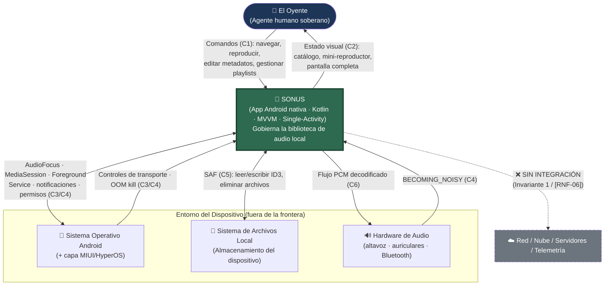
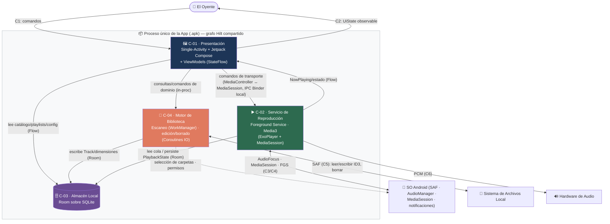
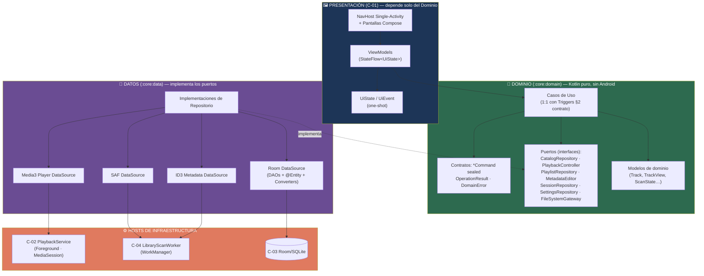

# Blueprint de Arquitectura de Software

> Este documento es el mapa topológico integral del sistema, unificando desde el contexto exterior hasta las estructuras atómicas de código. Se debe utilizar para gobernar las dependencias, responsabilidades y el stack tecnológico. Mantener el formato jerárquico estricto.
>

## 1. Contexto y Fronteras del Ecosistema

*Esta sección trata al sistema como una caja negra indivisible para mapear exclusivamente sus interacciones operativas con el mundo exterior*.

> **Encuadre.** Sonus es una **aplicación móvil Android nativa (Kotlin)**, **100% local y air-gapped** (Invariante 1 / [RNF-06]), con **Arquitectura Limpia**, patrón **Model–ViewModel–View** y enfoque **Single-Activity**. La frontera del sistema es el **artefacto `.apk` en ejecución** (proceso de aplicación + Foreground Service). El Motor de Biblioteca y el Motor de Reproducción (SDD §2.2) son agentes *lógicos internos* que residen dentro de esa frontera; se descomponen en las secciones 2 y 3. El único agente que cruza la frontera es **El Oyente**.

**Diagrama de Contexto del Sistema (C4 Nivel 1):**

### 1.1. Actores (Agentes Operativos)

- **El Oyente (Agente humano — Autoridad soberana absoluta):** Único usuario del sistema (Fase 1) y máxima autoridad dentro de sus fronteras (SDD §2.2 / Invariante 3). Inyecta comandos y consume resultados a través de dos superficies:
  - **En primer plano — Interfaz visual (Canales C1↑ / C2↓):** emite comandos discretos (`sealed interface`) sobre el `ViewModel` — configurar Carpetas Fuente, navegar y filtrar el catálogo, controlar la reproducción, editar metadatos ID3, gestionar playlists, eliminar archivos — y recibe el estado observable (`StateFlow<UiState>`) que alimenta la navegación de biblioteca, el mini-reproductor persistente y la pantalla de reproducción completa (SDD §2.1; contrato §1.1; [RF-01, RF-04..RF-08, RF-12]).
  - **En segundo plano — Controles de transporte (Canal C3):** gobierna la reproducción sin abrir la aplicación, mediante notificación persistente, pantalla de bloqueo o botones de auriculares (`MediaButton` → play/pause/next/prev/seek/stop) ([RF-13]; `TRG-ENV-03`).
  - **Nivel de autoridad:** soberano irrestricto. Ningún proceso interno puede anular, restringir ni anticipar su voluntad (Invariante 3). No existen roles secundarios, cuentas ni jerarquías de usuario.

### 1.2. Sistemas Externos (Dependencias)

*Software o hardware fuera de la jurisdicción del sistema pero de integración obligatoria (SDD §2.1 Out-of-Scope). Todas las dependencias son locales al dispositivo; ninguna es remota.*

- **Sistema Operativo Android (+ capa MIUI/HyperOS):** plataforma anfitriona y único proveedor de autorización (contrato §1.2). La integración se materializa sobre APIs de la capa estándar del SO ([RNF-09]):
  - **Storage Access Framework (SAF) — C5:** mecanismo único de acceso al almacenamiento (`ACTION_OPEN_DOCUMENT_TREE`, `DocumentFile`, permisos de árbol persistidos con `takePersistableUriPermission`); frontera de autorización efectiva por carpeta ([RF-01]; [Restricción 6]).
  - **Foco de Audio y salida — C4:** `AudioManager` / `AudioFocusRequest` (*ducking*/pausa — [RF-10]) y broadcast `ACTION_AUDIO_BECOMING_NOISY` (corte de seguridad periférica — [RF-11]).
  - **Sesión de Medios — C3:** `MediaSession` (androidx.media3.session) para publicar estado y recibir comandos de transporte en segundo plano ([RF-13]).
  - **Supervivencia del proceso — C4:** `Foreground Service` de tipo `mediaPlayback` anclado a notificación persistente, en tensión con las políticas de terminación de MIUI/HyperOS (Perturbación 3; [RNF-04]). El SO puede terminar el proceso por OOM, disparando la restauración de sesión (`TRG-ENV-05` / [RNF-05]).
  - **Decodificación de medios — C6:** `MediaCodec` / `AudioTrack` (vía el reproductor de AndroidX Media3) para decodificar y emitir audio ([RF-07]; [RNF-02, RNF-09]).
  - **Permisos declarados:** `POST_NOTIFICATIONS` (API 33+), `FOREGROUND_SERVICE` + `FOREGROUND_SERVICE_MEDIA_PLAYBACK`. Sin permisos de red ni de media runtime (ver §1.3).
- **Sistema de Archivos Local (Almacenamiento del dispositivo) — C5:** repositorio físico de los Archivos de Audio y sus Metadatos Embebidos (ID3). Fuente única de verdad del catálogo: el `Track` existe si y solo si su archivo existe (Invariante 2). Sonus lo lee (descubrimiento, extracción ID3, carátulas *on-demand*), escribe sobre él (etiquetas) y elimina archivos por orden explícita del Oyente, pero no gobierna su estructura general ([RF-02, RF-03, RF-04, RF-06]). Se accede siempre vía SAF, nunca por rutas textuales ni `MediaStore` (ver §1.3). Su volatilidad externa se absorbe por re-escaneo (Perturbaciones 4/5).
- **Hardware de Audio del dispositivo — C6:** destino físico del flujo de audio decodificado (PCM): altavoz, auriculares con cable y Bluetooth. Sonus emite hacia él a través del *pipeline* de audio del SO y reacciona a su desconexión (`BECOMING_NOISY` — [RF-11]); la mediación es del SO.

### 1.3. Exclusiones Explícitas (Anti-Alcance)

- **Cualquier red, servidor, servicio en la nube o API remota:** Sonus no establece comunicación de red. El binario **no declara `android.permission.INTERNET`**. *Justificación:* Invariante 1 (Autarquía Absoluta) / [RNF-06]. No existe "modo online" ni "funcionalidad premium remota".
- **Telemetría, analítica y reporte remoto de errores (Crashlytics, Sentry, analytics):** ningún paquete de reporte a terceros se compila en la aplicación. *Justificación:* [RNF-06] y principio P5; el registro, de existir, es estrictamente local y operativo. Refuerza la Invariante 3 ([RNF-07]).
- **`MediaStore` y permisos de media runtime (`READ_MEDIA_AUDIO` / `READ_EXTERNAL_STORAGE`):** el descubrimiento se realiza exclusivamente por SAF. *Justificación:* la identidad natural del `Track` es la URI de contenido SAF (modelo §1); los permisos de media runtime serían redundantes y divergirían del modelo SAF (contrato §1.2).
- **Servicios de enriquecimiento de metadatos/carátulas en línea y motores de recomendación o ML:** el sistema no consulta bases externas, no descarga carátulas remotas y no infiere, sugiere ni reorganiza contenido. *Justificación:* Invariante 4 (No Invención de Datos) e Invariante 3. Las carátulas se resuelven solo desde bytes embebidos ([F-5]).
- **Cuentas de usuario, autenticación e identidad:** no hay credenciales, tokens, sesiones ni perfiles. *Justificación:* sistema monousuario; la autorización se delega al modelo de permisos del SO (contrato §1.2). La costura multi-perfil (Fase 2) está prevista en el modelo de dominio, fuera del alcance de Fase 1.
- **Otras aplicaciones que compiten por recursos de audio:** sin integración directa; toda interacción está mediada por el SO vía foco de audio (`TRG-ENV-01`). *Justificación:* Sonus reacciona a las señales del SO, nunca negocia con otras apps (Perturbación 6).

## 2. Unidades Desplegables y Stack Tecnológico (Nivel Contenedores)

*Identifica las piezas de software y almacenamiento que se ejecutan de forma independiente*. *Esta es la base tecnológica del proyecto.*

> **Topología.** Sonus se distribuye como un único `.apk` que corre en un solo proceso del SO. Los "contenedores" de este nivel no son procesos separados, sino unidades con ciclo de vida de ejecución o almacenamiento independiente: la `Activity` anfitriona (ligada a la UI), el `Foreground Service` de reproducción (que sobrevive a la destrucción de la UI), las operaciones de biblioteca en segundo plano y el almacén Room/SQLite. Comparten un único grafo Hilt y una única instancia de base de datos.
>
> **Stack base transversal:** Kotlin · Corrutinas + `Flow`/`StateFlow` · Hilt · Arquitectura Limpia en 3 capas (presentación → dominio → datos), MVVM, Single-Activity. `minSdk` API 26+ con manejo específico de API 33+ (`POST_NOTIFICATIONS`, tipos de FGS). Justificaciones en los ADR (§5).

**Diagrama de Contenedores (C4 Nivel 2):**

### 2.1. Inventario de Contenedores

- **Contenedor `C-01`: `Presentación (Single-Activity Host)`**
  - **Naturaleza Técnica:** Capa de presentación Android nativa: una única `Activity` anfitriona + **Jetpack Compose** para la UI declarativa + **Navigation Compose** para los destinos internos (biblioteca, reproducción completa, configuración, onboarding). Los `ViewModel` exponen `StateFlow<UiState>` y consumen comandos modelados como `sealed interface`. Corre en el hilo principal; nunca ejecuta I/O de disco ni decodificación (contrato §4.3).
  - **Responsabilidad Central:** Materializar los canales C1 (comando) y C2 (estado). Traduce la voluntad del Oyente en comandos de dominio y proyecta el estado observable en las tres capas de interacción del SDD §2.1. Garantiza la latencia sub-500ms de navegación ([RNF-01]) mediante paginación (`PagingData`/`PagingSource`) y *debounce* del filtro textual (contrato §4.1). Es el único contenedor que conoce C1/C2 y desconoce C3–C6.
  - **Mapeo de Persistencia:** Ninguno durable. Solo estado transitorio de UI (scroll, foco, animaciones) en `ViewModel`/`SavedStateHandle`, que no se persiste.
- **Contenedor `C-02`: `Servicio de Reproducción en Primer Plano (Motor de Reproducción)`**
  - **Naturaleza Técnica:** `Foreground Service` de tipo `mediaPlayback` que hospeda **AndroidX Media3** (`ExoPlayer` + `MediaSession`/`MediaSessionService`). Anclado a notificación persistente ([RF-13]). Usa `AudioManager`/`AudioFocusRequest` y el receptor de `ACTION_AUDIO_BECOMING_NOISY`. Decodifica vía `MediaCodec`/`AudioTrack` de la capa estándar del SO ([RNF-09]).
  - **Responsabilidad Central:** Materializa el Motor de Reproducción (SDD §2.2) y el Equilibrio de Continuidad. Ejecuta la máquina de estados runtime `PlaybackStatus` (modelo §5.1), gestiona la cola, el foco de audio (C4), la sesión de medios (C3) y la emisión acústica (C6). Garante de la Invariante 6 y de la supervivencia ante MIUI/HyperOS ([RNF-04]); su ciclo de vida es independiente del de la `Activity`.
  - **Mapeo de Persistencia:** Escribe el estado durable de sesión en C-03: `PlaybackState` (singleton), `QueueItem` (doble orden `originalPosition`/`playbackPosition`) y marcadores `PlaybackProgress` de podcasts. Fuente para la restauración en <2s tras OOM ([RNF-05] / modelo §5.1).
- **Contenedor `C-03`: `Almacén Local (Base de Datos)`**
  - **Naturaleza Técnica:** **Room sobre SQLite** — persistencia nativa local, sin servidor. `@Database` único con `@TypeConverter` para los enums (serializados por nombre estable, no ordinal), DAOs con consultas indexadas y `PagingSource`. Migraciones versionadas; siembra del *Big Bang* (centinelas `id=1` de Artist/Album/Genre y singletons `PlaybackState`/`AppSettings`) en `onCreate` (modelo §6.1).
  - **Responsabilidad Central:** Resguardar la memoria durable con huella mínima ([RNF-08]) y garantizar integridad referencial (FKs `CASCADE`/`RESTRICT`, unicidad de posiciones) que materializa la Invariante 2. No contiene URLs remotas, tokens ni datos comportamentales ([RNF-06]/[RNF-07]).
  - **Mapeo de Persistencia:** Resguarda íntegramente el modelo de dominio: `Track`, `Artist`, `Album`, `Genre`, `SourceFolder`, `Playlist`, `PlaylistTrackCrossRef`, `QueueItem`, `PlaybackState`, `PlaybackProgress`, `AppSettings`. Las carátulas no se persisten (huella cero, [F-5]): se leen *on-demand* desde los bytes del archivo.
- **Contenedor `C-04`: `Motor de Biblioteca (Operaciones de Biblioteca en Segundo Plano)`**
  - **Naturaleza Técnica:** Unidad de ejecución en segundo plano, desacoplada del hilo principal ([RNF-03]), con dos modos: **(a)** escaneo/re-escaneo vía **WorkManager** (`CoroutineWorker`, diferible, cancelable, política single-flight — contrato §4.1); **(b)** edición de metadatos y borrado físico como corrutinas puntuales en `Dispatchers.IO` (operaciones inmediatas, no diferibles). Acceso a archivos vía **SAF** (`DocumentFile`, URIs de árbol persistidas); etiquetas mediante librería ID3 local sin red (ADR-004).
  - **Responsabilidad Central:** Materializa el Motor de Biblioteca (SDD §2.2). Ejecuta el ciclo de escaneo (`IDLE→SCANNING→SYNCING→IDLE`, modelo §5.3): descubre archivos, extrae ID3 sin inventar datos (Invariante 4), sincroniza el Catálogo de forma determinista ([RF-02/RF-03]), persiste ediciones de metadatos en disco ([RF-04]) y ejecuta eliminaciones físicas confirmadas ([RF-06]). Reporta progreso determinista (`ScanState`) por C2 si el escaneo supera 1s.
  - **Mapeo de Persistencia:** No posee almacén propio; escribe sobre C-03 (altas/bajas de `Track` y dimensiones, purga de huérfanos) y sobre el Sistema de Archivos (etiquetas ID3, borrado físico) vía C5.

### 2.2. Flujos y Protocolos de Comunicación *(intra-proceso, IPC local y sistema de archivos — sin red)*

> Al ser un sistema air-gapped ([RNF-06]), no existe ningún flujo sobre protocolo de red ni serialización *on-the-wire*. Todo flujo se resuelve en tres planos locales: intra-proceso (objetos inmutables Kotlin), IPC local con el SO (Binder/callbacks) y contra el sistema de archivos (SAF).

- **`C-01` View → ViewModel:** comandos del Oyente como `sealed interface` (C1); el estado desciende como `StateFlow<UiState>` (C2). **Transporte:** intra-proceso, objetos inmutables. **Naturaleza:** flujo reactivo unidireccional; *fire-and-forget* con desenlaces puntuales por flujo *one-shot* (`OperationResult`). [RNF-01]
- **`C-01` → `C-02`:** comandos de transporte (play/pause/next/prev/seek/stop, repeat/shuffle, construir/mutar cola). **Transporte:** `MediaController` ↔ `MediaSession` de Media3 (IPC Binder local), más un flujo `NowPlayingState` de vuelta. **Naturaleza:** asíncrona basada en eventos; el mismo puerto se refleja en segundo plano vía C3 (`MediaButton`). [RF-07/RF-08/RF-13]
- **`C-01` → `C-04`:** comandos de gestión (agregar/quitar carpeta, escanear, editar metadatos, playlists, eliminar archivo) y consultas observables. **Transporte:** invocación intra-proceso de casos de uso. **Naturaleza:** asíncrona en `Dispatchers.IO`; resultados por `OperationResult` + progreso por `ScanState` (C2). [RF-01..RF-06]
- **`C-01` → `C-03` (lectura):** catálogo, playlists y configuración se observan como `Flow`/`PagingSource` de Room. **Transporte:** consultas SQL locales. **Naturaleza:** reactiva; toda mutación re-emite automáticamente a la UI (Bucle de Coherencia del Catálogo, SDD §4.1). [RF-12]/[RNF-01]
- **`C-04` → `C-03` (escritura):** altas/bajas de `Track` y dimensiones, purga de huérfanos, ediciones. **Transporte:** DAOs Room en transacciones atómicas (contigüidad/unicidad, [F-8]). **Naturaleza:** asíncrona en segundo plano. [RF-02/RF-03/RF-04]
- **`C-02` → `C-03`:** lee la cola para reconstruir sesión; persiste `PlaybackState`, `QueueItem` y `PlaybackProgress`. **Transporte:** `SessionRepository` sobre DAOs Room. **Naturaleza:** asíncrona; escritura *snapshot* para restauración <2s ([RNF-05]).
- **`C-04` → `Sistema de Archivos` (C5):** lectura de bytes/ID3, escritura de etiquetas, borrado físico. **Transporte:** SAF (`DocumentFile` sobre URIs de árbol persistidas). **Naturaleza:** asíncrona; autorización delegada al permiso SAF por carpeta ([RF-01/RF-02/RF-04/RF-06], Invariante 2).
- **`C-02` → `SO`/`Hardware` (C3/C4/C6):** publica estado y recibe comandos por `MediaSession` (C3); negocia foco por `AudioManager` y recibe `BECOMING_NOISY` (C4); emite PCM al hardware (C6). **Transporte:** IPC Binder local y APIs de audio del SO. **Naturaleza:** bidireccional, basada en eventos; el sistema consume señales que no origina (contrato §2.4). [RF-10/RF-11/RF-13, RNF-04]

## 3. Topología Lógica (Componentes y Clases)

*Acercamiento microscópico al interior de los contenedores para identificar los bloques de código y las estructuras de datos atómicas*.

> **Regla de dependencia (Arquitectura Limpia).** Las dependencias apuntan hacia adentro: `Presentación → Dominio ← Datos`. El **Dominio** es Kotlin puro (sin Android): define modelos, contratos de comando (`sealed interface`), puertos (interfaces de repositorio) y casos de uso. La **capa de Datos** implementa los puertos e integra los frameworks (Room, SAF, Media3, ID3). La **capa de Presentación** (C-01) depende solo del dominio. Los contenedores C-02 y C-04 son hosts de infraestructura que ejecutan implementaciones de la capa de Datos, siempre a través de puertos. El cableado lo resuelve Hilt.
>
> **Módulos Gradle:** `:core:domain` (puro), `:core:data` (Room + SAF + ID3 + mappers), `:feature:library`, `:feature:player`, `:feature:playlists`, `:feature:settings`, `:service:playback` (C-02), `:service:indexer` (C-04), `:app` (Single-Activity + grafo Hilt).

**Diagrama de Componentes (C4 Nivel 3 — capas y dependencias):**

---

### Núcleo Transversal — Capa de Dominio (`:core:domain`)

*Kotlin puro, sin dependencias de Android. Materializa el Ubiquitous Language del glosario y los contratos del `interfaces_contract`.*

- **Módulo / Componente:** `Contratos de Interacción (Comandos, Consultas y Resultados)`
  - **Responsabilidad (SRP):** Definir el vocabulario cerrado y exhaustivo de intenciones del Oyente y los desenlaces del sistema, para que la comunicación View→dominio sea *type-safe* (`when` sin `else`).
  - **Interfaces Expuestas:** Jerarquías `sealed interface` de comandos y el envelope de resultado, consumidos por los `ViewModel` (emisión) y los casos de uso (recepción).
  - **Dependencias Internas:** Ninguna — es la raíz. Referencia solo los enums del modelo de dominio (`ContentType`, `RepeatMode`, etc.).
  - **Estructuras Atómicas Clave (Clases/Tipos):**
    - `LibraryCommand` / `PlayerCommand` / `PlaylistCommand` / `MetadataCommand` / `SettingsCommand`: `sealed interface` que encapsulan cada intención (`AddSourceFolder`, `PlayContext`, `Enqueue`, `EditTags`, `Create`, `SetTheme`…). Espejo de los `TRG-*` del contrato §2.
    - `OperationResult<T>` (`Success`/`Failure`): contrato de desenlace puntual (contrato §2.0).
    - `DomainError` + `ErrorDetails` + `Severity` + `IoCauseCode`: taxonomía de fallo como valor, nunca `throw` (principio P1, contrato §3). Sin campo `message` (i18n en presentación).
- **Módulo / Componente:** `Modelos de Dominio`
  - **Responsabilidad (SRP):** Representar las entidades del negocio de forma agnóstica a la persistencia (data classes puras), distintas de las `@Entity` de Room (modelo §1).
  - **Interfaces Expuestas:** Tipos inmutables consumidos por casos de uso y proyectados a la UI.
  - **Dependencias Internas:** Enums del dominio (§4 modelo).
  - **Estructuras Atómicas Clave (Clases/Tipos):**
    - `TrackView`: proyección de presentación del `Track` con dimensiones resueltas (centinelas `id=1` y `title=NULL` mapeados a etiqueta localizada en presentación). Salida de `TRG-NAV-01`.
    - `NowPlayingState`, `ScanState`, `ScanSummary`: modelos de estado observable (contrato §2.4/§2.5), transportados por `Flow`.
    - `PlaybackSource` (`Album`/`Artist`/`Genre`/`PlaylistRef`/`AdHoc`): `sealed interface` que define el contexto de construcción de cola (`TRG-PLAY-01`).
- **Módulo / Componente:** `Puertos (Interfaces de Repositorio)`
  - **Responsabilidad (SRP):** Declarar los contratos que la capa de Datos implementa, invirtiendo la dependencia.
  - **Interfaces Expuestas:** Interfaces `suspend`/`Flow` consumidas por los casos de uso.
  - **Dependencias Internas:** Modelos de dominio y contratos.
  - **Estructuras Atómicas Clave (Clases/Tipos):**
    - `CatalogRepository`: consulta observable **paginada** del catálogo (`browse(BrowseQuery): Flow<PagingData<TrackView>>`) y sincronización ([RF-12]/[RF-03]/[RNF-01]/[Restricción 4]).
    - `SourceFolderRepository`: alta/baja de carpetas y disparo de escaneo ([RF-01]).
    - `MetadataEditor`: **único** puerto de edición de ID3 + propagación al catálogo ([RF-04]).
    - `PlaylistRepository`: CRUD y reordenamiento de agrupaciones ([RF-05]).
    - `PlaybackController`: puerto hacia el Motor de Reproducción (comandos de transporte + `observeNowPlaying(): Flow<NowPlayingState>`) ([RF-07/08], [RF-13]).
    - `SessionRepository`: lectura/escritura del estado durable de sesión (`PlaybackState`/`QueueItem`/`PlaybackProgress`) — evita que C-02 toque DAOs directamente ([RF-14]/[RNF-05]).
    - `FileSystemGateway`: abstracción SAF (leer/escribir/borrar bytes, listar árbol) ([RF-06], Invariante 2).
    - `SettingsRepository`: preferencias y onboarding (contrato §2.6).
- **Módulo / Componente:** `Casos de Uso (Interactors)`
  - **Responsabilidad (SRP):** Orquestar una regla de negocio cada uno, aplicando invariantes y guardias. Relación 1:1 con los triggers del contrato §2.
  - **Interfaces Expuestas:** `operator fun invoke(command): OperationResult<T>` (o `Flow` para consultas).
  - **Dependencias Internas:** Consume los Puertos y Modelos; nunca implementaciones concretas.
  - **Estructuras Atómicas Clave (Clases/Tipos):**
    - `ScanLibraryUseCase`: aplica single-flight y determinismo del escaneo, con modos `FULL` e `INCREMENTAL` ([RF-02/03], `TRG-LIB-03`, §5.3).
    - `EditTrackTagsUseCase`: patrón parcial de campos + recálculo de FKs + purga de dimensiones huérfanas (Bucle de Coherencia, SDD §4.1).
    - `DeleteFileUseCase`: guardia de Invariante 5 (rechaza `confirmed=false` → `ERR_CONFIRMATION_REQUIRED`).
    - `PlayContextUseCase`, `EnqueueUseCase`, `SetShuffleUseCase`, `ReorderQueueUseCase`: construcción/mutación de cola preservando doble orden y reversibilidad ([F-3]/[F-8]/[F-13]).
    - `RestoreSessionUseCase`: rehidratación de sesión <2s sin autoplay; invocado por `PlaybackService` al arranque ([RNF-05], `TRG-ENV-05`).
    - `BrowseCatalogUseCase`, `ObserveNowPlayingUseCase`: consultas observables ([RNF-01]).

### Núcleo Transversal — Capa de Datos (`:core:data`) · resguarda al `Contenedor C-03`

*Única capa que integra frameworks. Implementa los puertos del dominio y mapea entre `@Entity` (Room) y modelos de dominio.*

- **Módulo / Componente:** `Implementaciones de Repositorio`
  - **Responsabilidad (SRP):** Cumplir cada puerto del dominio, coordinando *data sources* (Room, SAF, ID3, Media3) y capturando las excepciones de infraestructura en el borde para mapearlas a `DomainError` (principio P1).
  - **Interfaces Expuestas:** Implementan `CatalogRepository`, `MetadataEditor`, `PlaylistRepository`, `PlaybackController`, `SessionRepository`, `SourceFolderRepository`, `SettingsRepository`.
  - **Dependencias Internas:** DAOs de Room, `SafDataSource`, `Id3DataSource`, `Media3PlayerDataSource`, mappers.
  - **Estructuras Atómicas Clave (Clases/Tipos):**
    - `CatalogRepositoryImpl`: traduce `BrowseQuery` a consultas Room paginadas (`PagingSource` → `Flow<PagingData<TrackView>>`) y proyecta `TrackView` ([RNF-01]).
    - `MetadataEditorImpl`: **único orquestador** de edición ID3 — invoca `Id3DataSource.write` (disco) + actualización transaccional de `Track`/dimensiones (Room), con reversión optimista ante `ERR_TAG_WRITE_FAILED`.
    - `SessionRepositoryImpl`: persiste y rehidrata el estado de sesión sobre los DAOs (`PlaybackStateDao`/`QueueDao`/`PlaybackProgressDao`).
    - `ErrorMapper`: convierte excepciones SAF/Room/Media3 en `DomainError` tipados (borde de dominio, P1).
    - `EntityMappers`: funciones puras `Entity ↔ DomainModel`.
- **Módulo / Componente:** `Persistencia Room (Contenedor C-03)`
  - **Responsabilidad (SRP):** Materializar físicamente la memoria durable con integridad referencial y huella mínima ([RNF-08]).
  - **Interfaces Expuestas:** DAOs con métodos `suspend`/`Flow`/`PagingSource`; transacciones `@Transaction`.
  - **Dependencias Internas:** Ninguna hacia arriba; hoja de infraestructura.
  - **Estructuras Atómicas Clave (Clases/Tipos):**
    - `SonusDatabase` (`@Database`): agrega todas las `@Entity` del modelo §2 y siembra el *Big Bang* (§6.1) en `onCreate`.
    - `TrackDao`, `PlaylistDao`, `QueueDao`, `PlaybackStateDao`, `PlaybackProgressDao`, `SourceFolderDao`, `DimensionDao` (Artist/Album/Genre), `SettingsDao`: SRP por agregado; consultas indexadas para [RNF-01].
    - `RoomTypeConverters`: serializa enums por nombre estable, nunca ordinal (modelo §1).
    - Las `@Entity` (`Track`, `Artist`, `Album`, `Genre`, `SourceFolder`, `Playlist`, `PlaylistTrackCrossRef`, `QueueItem`, `PlaybackState`, `PlaybackProgress`, `AppSettings`) son las definidas en `domain_and_state_model §2`.
- **Módulo / Componente:** `Data Sources de Infraestructura Local`
  - **Responsabilidad (SRP):** Aislar cada tecnología externa tras una fachada delgada.
  - **Estructuras Atómicas Clave (Clases/Tipos):**
    - `SafDataSource`: envuelve `DocumentFile`/`ContentResolver`; recorrido recursivo, `takePersistableUriPermission`, lectura/escritura/borrado de bytes (C5).
    - `Id3DataSource`: lectura/escritura de etiquetas con librería local sin red (ADR-004); traduce límites de formato a `ERR_TAG_WRITE_FAILED` ([Restricción 3]).
    - `Media3PlayerDataSource`: puente hacia el `PlaybackService` (C-02) vía `MediaController`; expone `NowPlayingState`.

---

### Contenedor: `C-01` (Presentación — Single-Activity)

- **Módulo / Componente:** `ViewModels de Característica`
  - **Responsabilidad (SRP):** Mantener el estado de UI de su pantalla como `StateFlow<UiState>` inmutable, traducir gestos del Oyente en comandos de dominio y delegar en casos de uso. No contiene reglas de negocio ni I/O.
  - **Interfaces Expuestas:** `val uiState: StateFlow<UiState>`, `val events: SharedFlow<UiEvent>` (one-shot), y funciones `onCommand(cmd)` (canal C1).
  - **Dependencias Internas:** Casos de uso del dominio (inyectados por Hilt). Nunca repositorios ni data sources directamente.
  - **Estructuras Atómicas Clave (Clases/Tipos):**
    - `LibraryViewModel`: expone catálogo filtrado y paginado; aplica *debounce* del filtro textual (contrato §4.1) y consume `BrowseCatalogUseCase`.
    - `PlayerViewModel`: observa `NowPlayingState` y despacha comandos de transporte (mini-reproductor + pantalla completa) sobre `ObserveNowPlayingUseCase` + `PlaybackController`.
    - `PlaylistViewModel`, `MetadataEditorViewModel`, `SettingsViewModel`, `OnboardingViewModel`: uno por flujo funcional.
    - `UiState` (por pantalla) y `UiEvent`: `data class`/`sealed interface` inmutables; los eventos efímeros (errores, "pista omitida") viajan por `SharedFlow`/`Channel` para no re-emitirse en recomposición (contrato §1.2).
- **Módulo / Componente:** `Navegación y Superficie Compose`
  - **Responsabilidad (SRP):** Alojar los destinos dentro de la única `Activity` y renderizar el estado; emular las transiciones fluidas tipo streaming del SDD §2.1.
  - **Interfaces Expuestas:** `NavHost` con rutas tipadas; funciones `@Composable` que reciben `UiState` y elevan eventos (*state hoisting*).
  - **Dependencias Internas:** `ViewModels` (vía `hiltViewModel()`).
  - **Estructuras Atómicas Clave (Clases/Tipos):**
    - `MainActivity`: única `Activity` anfitriona; host del `NavHost` y del `ThemePreference` efectivo.
    - `SonusNavHost` + `Screen` (rutas): biblioteca, reproducción completa, editor de metadatos, playlists, configuración, onboarding.
    - `MiniPlayerBar` (persistente), `ArtworkImage` (Coil, caché solo en memoria, [F-5]).

### Contenedor: `C-02` (Servicio de Reproducción — Foreground Service)

- **Módulo / Componente:** `PlaybackService (Host de Sesión de Medios)`
  - **Responsabilidad (SRP):** Ser el `Foreground Service` de tipo `mediaPlayback` que mantiene vivo el Motor de Reproducción con independencia de la UI ([RNF-04]); publica la `MediaSession` y la notificación persistente ([RF-13]). Al arranque invoca `RestoreSessionUseCase` para rehidratar la sesión ([RNF-05]).
  - **Interfaces Expuestas:** `MediaSession` hacia el SO (C3) y hacia `MediaController` de C-01; ciclo de vida de servicio.
  - **Dependencias Internas:** `SonusPlayer`, `MediaSessionCallback`, `AudioFocusManager`, `SessionPersistenceCoordinator`, `RestoreSessionUseCase`.
  - **Estructuras Atómicas Clave (Clases/Tipos):**
    - `PlaybackService` (`MediaSessionService`): orquesta el arranque en primer plano, la restauración inicial y el retiro/degradado de la notificación al `STOP`.
    - `PlaybackNotificationManager`: construye la notificación de transporte (refleja `NowPlayingState`).
- **Módulo / Componente:** `Motor de Reproducción (Núcleo Runtime)`
  - **Responsabilidad (SRP):** Ejecutar la máquina de estados `PlaybackStatus` (§5.1): decodificar, emitir PCM (C6), avanzar la cola y absorber fallos de pista (Invariante 6 / [RF-09]).
  - **Interfaces Expuestas:** Estado observable `Flow<NowPlayingState>` y operaciones de transporte (consumidas por `MediaSessionCallback`).
  - **Dependencias Internas:** `QueueManager` (orden), `SessionRepository` (durabilidad, vía `SessionPersistenceCoordinator`).
  - **Estructuras Atómicas Clave (Clases/Tipos):**
    - `SonusPlayer`: fachada sobre `ExoPlayer` (Media3). Traduce eventos del reproductor (`TrackEndEvent`: `Completed`/`DecodeError`/`FileMissing`) en transiciones de estado y actualización de `Track.availability` (§5.2).
    - `QueueManager`: gestiona `QueueItem` con doble orden (`originalPosition`/`playbackPosition`), reversibilidad de shuffle ([F-3]) y mutación en caliente ([F-13]); mantiene contigüidad ([F-8]) en transacción única.
    - `AudioFocusManager`: encapsula `AudioFocusRequest`; mapea `AudioFocusEvent` a *ducking*/pausa ([RF-10], `TRG-ENV-01`).
    - `BecomingNoisyReceiver`: `BroadcastReceiver` de `ACTION_AUDIO_BECOMING_NOISY` → pausa instantánea ([RF-11], `TRG-ENV-02`).
    - `MediaSessionCallback`: traduce `MediaButtonCommand` (C3) a operaciones internas — espejo en segundo plano del canal C1 (`TRG-ENV-03`).
    - `SessionPersistenceCoordinator`: escribe periódicamente el snapshot de sesión (`PlaybackState`/`QueueItem`/`PlaybackProgress`) a través de `SessionRepository`.

### Contenedor: `C-04` (Motor de Biblioteca — Operaciones en Segundo Plano)

- **Módulo / Componente:** `Orquestador de Escaneo`
  - **Responsabilidad (SRP):** Gobernar el ciclo `IDLE→SCANNING→SYNCING→IDLE` (§5.3) vía WorkManager ([RNF-03]) con política single-flight (contrato §4.1) y progreso determinista.
  - **Interfaces Expuestas:** `Worker` encolable/cancelable; emite `Flow<ScanState>` (C2) hacia presentación.
  - **Dependencias Internas:** `SafDataSource`, `Id3DataSource`, `CatalogSynchronizer`, DAOs de C-03.
  - **Estructuras Atómicas Clave (Clases/Tipos):**
    - `LibraryScanWorker` (`CoroutineWorker`): punto de entrada del escaneo; corre en `Dispatchers.IO`, reporta progreso vía `setProgress`/`Flow` y respeta cancelación por el Oyente.
    - `CatalogSynchronizer`: núcleo determinista de [RF-03] — diff sistema-de-archivos vs. catálogo (modos `FULL` e `INCREMENTAL` por `fileLastModifiedMs`/`uri`), altas, marcado `MISSING`, purga por fidelidad (Invariante 2) y purga de dimensiones huérfanas ([RNF-08]) en transacción.
    - `ScanStateEmitter`: publica `ScanState.Scanning(processed,total)`/`Syncing`/`Finished`/`Aborted` ([RNF-03]); conserva el último catálogo coherente ante `ERR_SCAN_ABORTED`.
- **Módulo / Componente:** `Ejecución de Metadatos y Borrado`
  - **Responsabilidad (SRP):** Ejecutar la edición de metadatos ([RF-04]) y el borrado físico confirmado ([RF-06]) como corrutinas puntuales en `Dispatchers.IO`, delegando la orquestación en los repositorios del dominio (`MetadataEditor`, `FileSystemGateway`). No usa WorkManager.
  - **Interfaces Expuestas:** Ejecución de los casos de uso `EditTrackTagsUseCase` y `DeleteFileUseCase` en segundo plano.
  - **Dependencias Internas:** `MetadataEditorImpl` → `Id3DataSource`; borrado vía `SafDataSource`; re-sincronización de dimensiones huérfanas tras la operación.

## 4. Trazabilidad Funcional

*Matriz que garantiza la ejecución del código frente a las necesidades del negocio. Enlaza cada requisito con su trigger del `interfaces_contract` (§2) y con el componente responsable de la Sección 3.*

### 4.1. Requerimientos Funcionales → Componentes

| Requisito | Trigger(s) | Órgano(s) responsable(s) | Contenedor |
|---|---|---|---|
| **[RF-01]** Config. Carpetas Fuente | `TRG-LIB-01/02` | `AddSourceFolderUseCase` · `RemoveSourceFolderUseCase` → `SourceFolderRepository` → `SafDataSource` | C-04 / Datos |
| **[RF-02]** Escaneo + extracción ID3 | `TRG-LIB-03` | `LibraryScanWorker` → `SafDataSource` + `Id3DataSource` | C-04 |
| **[RF-03]** Sincronización determinista del Catálogo | `TRG-LIB-03/04` | `CatalogSynchronizer` (diff, altas, `MISSING`, purga por fidelidad + huérfanos) | C-04 / C-03 |
| **[RF-04]** Edición directa de metadatos | `TRG-META-01` | `EditTrackTagsUseCase` → `MetadataEditor` → `MetadataEditorImpl` → `Id3DataSource` | Dominio / Datos / C-04 |
| **[RF-05]** Gestión de Playlists | `TRG-PLST-01…06` | `Create/Rename/AddTracks/RemoveTrack/Reorder/DeletePlaylistUseCase` → `PlaylistRepository` → `PlaylistDao` | Dominio / C-03 |
| **[RF-06]** Eliminación física con confirmación | `TRG-FILE-01` | `DeleteFileUseCase` (guardia Invariante 5) → `FileSystemGateway`/`SafDataSource` + purga en cascada (Room) | Dominio / C-04 / C-03 |
| **[RF-07]** Decodificación y emisión continua | `TRG-PLAY-01/02/05/06` | `SonusPlayer` (ExoPlayer) hospedado en `PlaybackService` | C-02 |
| **[RF-08]** Cola multimodal (seq/shuffle/repeat) | `TRG-PLAY-07/08`, `TRG-QUEUE-01/02/03` | `QueueManager` (doble orden [F-3], contigüidad [F-8]) + `SessionRepository` | C-02 / C-03 |
| **[RF-09]** Tolerancia a fallos de pista | `TRG-ENV-04` | `SonusPlayer` (mapeo `TrackEndEvent` → salto automático; actualiza `Track.availability`) | C-02 |
| **[RF-10]** Gestión activa del foco de audio | `TRG-ENV-01` | `AudioFocusManager` (`AudioFocusRequest` → *ducking*/pausa) | C-02 |
| **[RF-11]** Corte de seguridad periférica | `TRG-ENV-02` | `BecomingNoisyReceiver` (pausa instantánea, reanudación manual) | C-02 |
| **[RF-12]** Navegación taxonómica multicapa | `TRG-NAV-01` | `LibraryViewModel` → `BrowseCatalogUseCase` → `CatalogRepositoryImpl` → `TrackDao` (índices) | C-01 / Datos / C-03 |
| **[RF-13]** Control persistente en 2º plano | `TRG-OBS-01`, `TRG-ENV-03` | `PlaybackService` + `MediaSessionCallback` + `PlaybackNotificationManager` | C-02 |
| **[RF-14]** Persistencia del estado de sesión | `TRG-ENV-05` | `SessionPersistenceCoordinator` + `RestoreSessionUseCase` → `SessionRepository` | C-02 / Dominio / C-03 |
| **Configuración y Onboarding** *(soporta Apalancamiento 5, SDD §4.1; sin RF asociado)* | `TRG-CFG-01/02` | `SetThemeUseCase` · `CompleteOnboardingUseCase` → `SettingsRepository` → `SettingsDao`; `SettingsViewModel`/`OnboardingViewModel` | C-01 / C-03 |

### 4.2. Requerimientos No Funcionales → Componentes / Estrategias

| Requisito | Órgano(s) / Estrategia arquitectónica | Contenedor |
|---|---|---|
| **[RNF-01]** Latencia visual < 500 ms | `CatalogRepositoryImpl` con `PagingSource`; índices de navegación (modelo §1); *debounce* en `LibraryViewModel` | C-01 / Datos / C-03 |
| **[RNF-02]** Latencia de reproducción sub-segundo | `SonusPlayer` (estado `PREPARING` visible; sin congelar UI) | C-02 |
| **[RNF-03]** Escaneo asíncrono con progreso | `LibraryScanWorker` (`CoroutineWorker`, `Dispatchers.IO`) + `ScanStateEmitter`; single-flight | C-04 |
| **[RNF-04]** Supervivencia ante el SO | `PlaybackService` como Foreground Service `mediaPlayback` + notificación persistente | C-02 |
| **[RNF-05]** Restauración de estado < 2 s | `RestoreSessionUseCase` + `SessionPersistenceCoordinator` → `SessionRepository` (rehidrata sin autoplay) | Dominio / C-02 |
| **[RNF-06]** Aislamiento de red (air-gapped) | Ausencia de `android.permission.INTERNET`; sin data sources remotos; auditable en CI (ADR-010) | Transversal / `:app` |
| **[RNF-07]** Integridad de datos comportamentales | Anti-convención del esquema Room (sin `playCount`/`lastPlayedAt`…, modelo §1); sin componentes de *tracking* | C-03 / Transversal |
| **[RNF-08]** Huella de almacenamiento | Esquema Room normalizado; carátulas no persistidas (`ArtworkImage`/Coil solo-memoria, [F-5]); purga de huérfanos (`CatalogSynchronizer`) | C-03 / C-01 / C-04 |
| **[RNF-09]** Portabilidad de hardware base | `SonusPlayer` sobre `MediaCodec`/`AudioTrack` estándar de AndroidX Media3; sin librerías propietarias | C-02 |

### 4.3. Invariantes del Dominio → Puntos de Enforcement

| Invariante | Punto(s) de garantía en el código |
|---|---|
| **Inv. 1 — Autarquía absoluta** | Manifiesto sin `INTERNET`; capa de Datos sin data source remoto ([RNF-06]) |
| **Inv. 2 — Fidelidad al sistema de archivos** | `CatalogSynchronizer` (purga `MISSING` + cascada); FKs `CASCADE` de Room; identidad natural = `uri` |
| **Inv. 3 — Soberanía y privacidad** | Sin motores de recomendación/ML; anti-convención de datos comportamentales; sin cuentas |
| **Inv. 4 — No invención de datos** | `Id3DataSource` + `CatalogSynchronizer` asignan centinela `id=1`/`NULL`, nunca infieren |
| **Inv. 5 — Irreversibilidad consciente** | `DeleteFileUseCase` rechaza `confirmed=false` (`ERR_CONFIRMATION_REQUIRED`) |
| **Inv. 6 — Continuidad como prioridad** | `SonusPlayer` (salto automático ante `DecodeError`/`FileMissing`); solo `STOPPED` si no queda pista |
| **Inv. 7 — Gratuidad total** | Sin componentes de monetización/paywall/anuncios en ningún módulo |

## 5. Registros de Decisiones Arquitectónicas (ADR)

*El registro formal que justifica las elecciones tecnológicas de este documento.*

| ADR | Decisión |
|---|---|
| ADR-001 | Room sobre SQLite como persistencia local |
| ADR-002 | AndroidX Media3 (ExoPlayer + MediaSession) |
| ADR-003 | Storage Access Framework (SAF) en lugar de MediaStore |
| ADR-004 | Librería de metadatos ID3 local + puente SAF |
| ADR-005 | Jetpack Compose + Single-Activity + Navigation |
| ADR-006 | WorkManager para el escaneo en segundo plano |
| ADR-007 | Foreground Service `mediaPlayback` (defensa en profundidad) |
| ADR-008 | Hilt para inyección de dependencias |
| ADR-009 | Carátulas de huella cero (Coil, caché solo en memoria) |
| ADR-010 | Air-gapped verificable (sin permiso `INTERNET`, sin telemetría) |

### ADR-001: Uso de Room sobre SQLite para el almacenamiento local

- **Contexto:** El sistema requiere memoria durable normalizada, con integridad referencial estricta y consultas indexadas sub-500ms sobre decenas de miles de filas ([RNF-01]/[RNF-08]), 100% local (Invariante 1). El modelo de dominio ya está expresado en sintaxis Kotlin/Room.
- **Decisión:** Adoptar **Room** sobre **SQLite** como único motor de persistencia. SQLite es nativo del SO ([RNF-09]); Room aporta verificación de consultas en compilación, `@TypeConverter`, integración con corrutinas/`Flow` y `PagingSource`.
- **Consecuencias:**
  - **(+)** Integridad referencial declarativa (FKs `CASCADE`/`RESTRICT`) que materializa la Invariante 2 a nivel de esquema; observabilidad reactiva (`Flow`).
  - **(+)** Huella mínima y cero dependencias externas; alineado con el modelo de dominio.
  - **(−)** El filtro textual se resuelve con `LIKE` indexado; búsqueda avanzada requeriría FTS4/5 (extensión futura).
  - **(−)** Las migraciones de esquema exigen versionado y tests de migración.

### ADR-002: AndroidX Media3 (ExoPlayer + MediaSession) para reproducción y control en segundo plano

- **Contexto:** El Motor de Reproducción debe decodificar múltiples formatos con APIs estándar ([RNF-09]), mantener reproducción en segundo plano ([RNF-04]), exponer controles en notificación/lockscreen ([RF-13]) y gestionar foco de audio ([RF-10]).
- **Decisión:** Usar **AndroidX Media3**: `ExoPlayer` como reproductor y `MediaSession`/`MediaSessionService` para la integración con el SO.
- **Consecuencias:**
  - **(+)** Integración nativa entre reproductor, sesión y notificación; manejo robusto de foco de audio, `BECOMING_NOISY` y `MediaButton`.
  - **(+)** Decodificación sobre `MediaCodec` estándar, sin códecs propietarios ([RNF-09]).
  - **(−)** Dependencia pesada con evolución de API rápida; obliga a fijar versiones.
  - **(−)** La fuente de verdad de la cola es `QueueManager` (no el estado interno de ExoPlayer), para preservar la reversibilidad de shuffle ([F-3]) y la restauración.

### ADR-003: Storage Access Framework (SAF) en lugar de MediaStore

- **Contexto:** El descubrimiento se limita a Carpetas Fuente elegidas por el Oyente ([RF-01]); se requiere escribir etiquetas y borrar archivos ([RF-04]/[RF-06]); la identidad natural del `Track` es una URI persistida (modelo §1). `MediaStore` indexaría todo el audio del dispositivo (contaminando la biblioteca) y limita escritura/borrado bajo Scoped Storage.
- **Decisión:** Acceder al almacenamiento exclusivamente vía **SAF** (`ACTION_OPEN_DOCUMENT_TREE`, `DocumentFile`, `takePersistableUriPermission`). No declarar `READ_MEDIA_AUDIO` ni `READ_EXTERNAL_STORAGE`.
- **Consecuencias:**
  - **(+)** El Oyente delimita el perímetro exacto de escaneo (soberanía, Apalancamiento 2); permisos persistidos por carpeta.
  - **(+)** Coherente con la identidad natural del `Track` (URI SAF).
  - **(−)** SAF es más verboso y lento que el acceso por ruta; el recorrido recursivo con `DocumentFile` se mitiga en `Dispatchers.IO` con progreso ([RNF-03]).
  - **(−)** La escritura de metadatos sobre content-URIs requiere el puente del ADR-004.

### ADR-004: Librería de metadatos ID3 local con puente SAF

- **Contexto:** [RF-04] exige leer y escribir etiquetas ID3 (ID3v1/v2, Vorbis Comments — [Restricción 3]) sobre el archivo físico. `MediaMetadataRetriever` solo lee. Las librerías maduras operan sobre `java.io.File`, incompatible con content-URIs de SAF (ADR-003). Todo debe ser local, sin red ([RNF-06]).
- **Decisión:** Adoptar una librería JVM de *tagging* local (JAudioTagger o un *fork* para Android), encapsulada tras `Id3DataSource`. Puente SAF↔`File`: copiar a caché privada vía stream SAF, editar la etiqueta y reescribir los bytes al content-URI original (`ContentResolver.openOutputStream`).
- **Consecuencias:**
  - **(+)** Cumple la escritura de ID3 manteniéndose 100% local; el resto del sistema solo ve el puerto `MetadataEditor`.
  - **(−)** El ciclo copiar-editar-reescribir sobre SAF puede ser lento para archivos grandes y debe garantizar atomicidad (no corromper el archivo ante fallo). Es la decisión con mayor incertidumbre técnica; se valida con una prueba de concepto temprana.
  - **(−)** La cobertura de escritura depende de la librería; formatos no soportados degradan a `ERR_TAG_WRITE_FAILED` (contrato §3.2).
  - **(−)** Licencia a auditar (JAudioTagger es LGPL) para compatibilidad con la distribución gratuita (Invariante 7).

### ADR-005: Jetpack Compose + Single-Activity + Navigation Compose

- **Contexto:** El SDD exige una interfaz fluida y estéticamente coherente al nivel de plataformas de streaming (Apalancamiento 4), con modelo reactivo (`StateFlow<UiState>`) y latencia sub-500ms ([RNF-01]), sobre MVVM + Single-Activity.
- **Decisión:** Construir la presentación con **Jetpack Compose** sobre una única `Activity`, con **Navigation Compose** para los destinos internos.
- **Consecuencias:**
  - **(+)** Encaje natural con el flujo unidireccional de estado; menos *boilerplate* que Vistas XML + Fragments; transiciones fluidas.
  - **(+)** Single-Activity simplifica el ciclo de vida y el *back stack*.
  - **(−)** Curva de aprendizaje y disciplina de rendimiento (estabilidad de estado, `remember`, listas con `key`).
  - **(−)** Requiere virtualización (`LazyColumn` + paginación Room) en catálogos grandes ([Restricción 4]).

### ADR-006: WorkManager para el escaneo en segundo plano

- **Contexto:** El escaneo debe correr fuera del hilo principal, ser cancelable, reportar progreso y sobrevivir a la presión de recursos ([RNF-03]); además debe ser single-flight (contrato §4.1).
- **Decisión:** Ejecutar el escaneo como **`CoroutineWorker` de WorkManager** con trabajo único (`ExistingWorkPolicy.KEEP`). La edición de metadatos y el borrado, al ser inmediatos, corren como corrutinas puntuales fuera de WorkManager.
- **Consecuencias:**
  - **(+)** Garantías de ejecución y cancelación; single-flight vía trabajo único con nombre; progreso observable ([RNF-03]).
  - **(+)** Desacopla el escaneo del ciclo de vida de la UI.
  - **(−)** WorkManager añade latencia de planificación; el escaneo manual inmediato usa `setExpedited`.
  - **(−)** Bajo políticas agresivas (MIUI/HyperOS) el trabajo diferido puede posponerse.

### ADR-007: Foreground Service `mediaPlayback` como estrategia de supervivencia (defensa en profundidad)

- **Contexto:** La perturbación más crítica es la terminación forzada de procesos por MIUI/HyperOS (Perturbación 3, [RNF-04]); el SO tiene la última palabra ([Restricción 5]).
- **Decisión:** Defensa en profundidad: (1) `Foreground Service` `mediaPlayback` con notificación persistente; (2) persistencia periódica de `PlaybackState`/`QueueItem`; (3) restauración <2s al reinicio sin autoplay ([RNF-05]). La estrategia de supervivencia se aísla en un componente actualizable (SDD §4.2).
- **Consecuencias:**
  - **(+)** Maximiza la continuidad (Invariante 6) dentro de lo que el SO permite; la restauración evita perder el contexto de sesión.
  - **(+)** Aislar la estrategia permite adaptarla a futuras versiones del SO sin tocar el resto.
  - **(−)** La notificación persistente es obligatoria y visible; requiere `POST_NOTIFICATIONS` (API 33+).
  - **(−)** No hay garantía absoluta de supervivencia; se acepta la tensión con el entorno como propiedad inherente (SDD Emergencia 4).

### ADR-008: Hilt para inyección de dependencias

- **Contexto:** La Arquitectura Limpia exige inversión de dependencias y un cableado consistente entre módulos (`:core`, `:feature`, `:service`), incluyendo `Service` y `Worker`.
- **Decisión:** Usar **Hilt** (sobre Dagger), con soporte de primera clase para `ViewModel`, `WorkManager` (`@HiltWorker`) y `Service`.
- **Consecuencias:**
  - **(+)** Cableado verificado en compilación; *scopes* claros; fuerza la regla de dependencia entre módulos.
  - **(−)** Sobrecoste de anotaciones y tiempo de compilación (KSP); configuración cuidadosa para `Worker` y `Service`.

### ADR-009: Carátulas de huella cero (Coil con caché solo en memoria)

- **Contexto:** [RNF-08] y [F-5] exigen no persistir carátulas como archivos; deben leerse *on-demand* desde los bytes embebidos (`hasEmbeddedArtwork = true`), sin URLs remotas (Invariante 1).
- **Decisión:** Usar **Coil** para cargar carátulas desde la `uri` del track/álbum, con caché exclusivamente en memoria (disk cache deshabilitado).
- **Consecuencias:**
  - **(+)** Huella en disco cero ([RNF-08]); integración idiomática con Compose; sin red.
  - **(−)** Cada arranque en frío re-decodifica las imágenes visibles desde el archivo (coste de CPU/IO aceptable frente al ahorro de almacenamiento).

### ADR-010: Air-gapped verificable — sin permiso `INTERNET` ni telemetría

- **Contexto:** La Invariante 1 y [RNF-06] son inquebrantables: cero red, cero telemetría (P5). Debe ser estructural y auditable.
- **Decisión:** No declarar `android.permission.INTERNET` ni compilar ningún SDK de red/analítica/reporte de errores. Añadir una verificación automatizada en CI que falle el *build* si el manifiesto final (mergeado con dependencias) contiene el permiso de red.
- **Consecuencias:**
  - **(+)** La autarquía pasa de promesa a garantía verificable; cualquier dependencia transitiva que introduzca red rompe el *build*.
  - **(+)** Refuerza la privacidad absoluta (Invariante 3).
  - **(−)** Restringe el catálogo de librerías utilizables; obliga a auditar dependencias transitivas.
