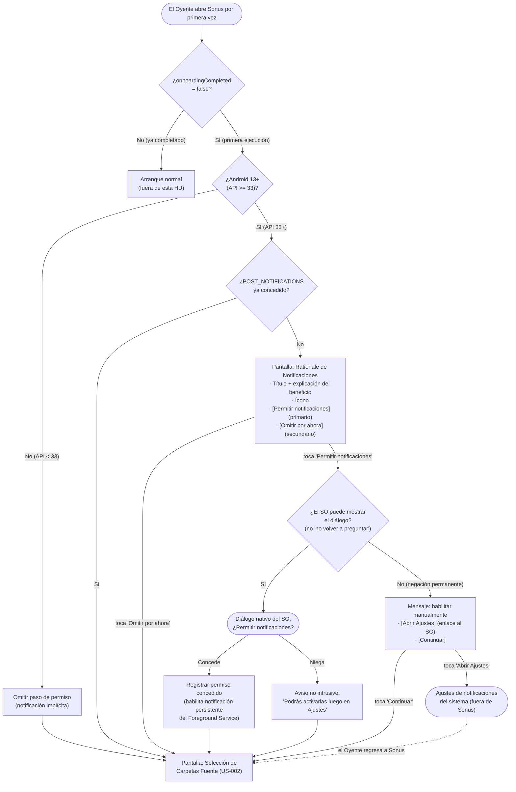

# Preview de Interfaz — HU #US-001: Conceder los permisos del sistema

> ⚠️ **PROPUESTA PENDIENTE DE VALIDACIÓN CON DISEÑO** — Este prototipo debe ser revisado y aprobado por el equipo de diseño antes de implementarse.
>
> Formato: **Mermaid (flujo de navegación)** · Plataforma inferida: **mobile** · Línea gráfica: *defaults* (sin proyecto frontend en el workspace).

## Leyenda de trazabilidad (AC → flujo)

| AC | Rama del diagrama |
|----|-------------------|
| Escenario 1 (Flujo Principal) | Rationale → diálogo SO → Concede → Carpetas Fuente |
| Escenario 2 (Negación simple) | Diálogo SO → Niega → aviso → Carpetas Fuente |
| Escenario 3 (API < 33) | Omitir paso → Carpetas Fuente |
| Escenario 4 (Negación permanente) | ¿SO puede mostrar? = No → mensaje + Abrir Ajustes |
| Escenario 5 (Idempotencia) | ¿Ya concedido? = Sí → Carpetas Fuente |
| Escenario 6 (Autarquía) | Invariante transversal (sin nodo de red; verificable en manifiesto) |
