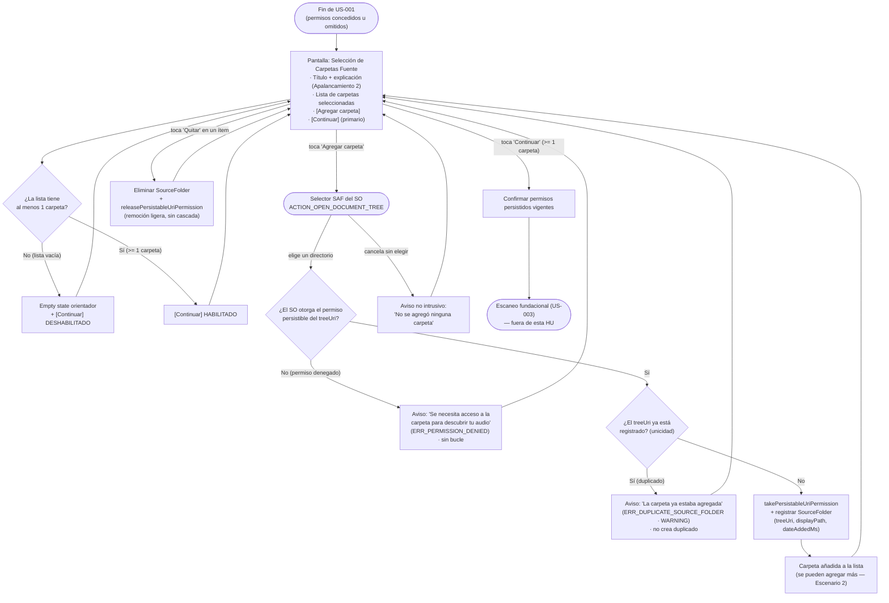

# Preview de Interfaz — HU #US-002: Selección guiada de Carpetas Fuente iniciales

> ⚠️ **PROPUESTA PENDIENTE DE VALIDACIÓN CON DISEÑO** — Este prototipo debe ser revisado y aprobado por el equipo de diseño antes de implementarse.
>
> Formato: **Mermaid (flujo de navegación)** · Plataforma inferida: **mobile** · Línea gráfica: *defaults* (sin proyecto frontend en el workspace).

## Leyenda de trazabilidad (AC → flujo)

| AC | Rama del diagrama |
|----|-------------------|
| Escenario 1 (Flujo Principal) | Agregar carpeta → SAF → otorga permiso → no duplicado → registrar → lista |
| Escenario 2 (Múltiples carpetas) | Registrar → "se pueden agregar más" → volver a la pantalla |
| Escenario 3 (Obligatoriedad ≥1) | ¿Lista tiene ≥1? → No → [Continuar] deshabilitado / Sí → habilitado |
| Escenario 4 (Duplicado) | ¿treeUri ya registrado? = Sí → aviso `ERR_DUPLICATE_SOURCE_FOLDER` |
| Escenario 5 (Cancelación / permiso denegado) | Cancela → aviso; ¿otorga permiso? = No → `ERR_PERMISSION_DENIED` |
| Escenario 6 (Quitar de la lista) | Quitar ítem → eliminar `SourceFolder` + liberar permiso (sin cascada) |
| Escenario 7 (Confirmar y transitar) | [Continuar] → confirmar permisos → escaneo (US-003) |
| Escenario 8 (Autarquía) | Invariante transversal (solo SAF; sin `MediaStore`/media runtime/red — verificable) |
