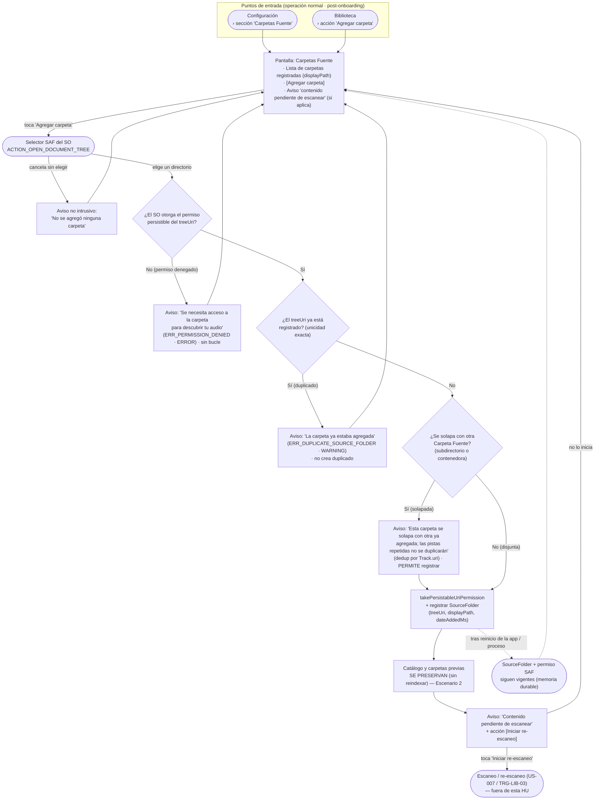

# Preview de Interfaz — HU #US-005: Agregar una Carpeta Fuente

> ⚠️ **PROPUESTA PENDIENTE DE VALIDACIÓN CON DISEÑO** — Este prototipo debe ser revisado y aprobado por el equipo de diseño antes de implementarse.
>
> Formato: **Mermaid (flujo de navegación)** · Plataforma inferida: **mobile** · Línea gráfica: *defaults* (sin proyecto frontend en el workspace).

## Leyenda de trazabilidad (AC → flujo)

| AC | Rama del diagrama |
|----|-------------------|
| Escenario 1 (Flujo Principal) | Agregar → SAF → otorga permiso → no duplicado → no solapada → registrar → carpeta en lista |
| Escenario 2 (Preservar biblioteca) | Registrar → "Catálogo y carpetas previas se preservan (sin reindexar)" |
| Escenario 3 (Duplicado exacto) | ¿treeUri ya registrado? = Sí → aviso `ERR_DUPLICATE_SOURCE_FOLDER` |
| Escenario 4 (Solapamiento) | ¿Se solapa? = Sí → aviso y **permite** registrar (dedup por `Track.uri`) |
| Escenario 5 (Cancelación / permiso denegado) | Cancela → aviso; ¿otorga permiso? = No → `ERR_PERMISSION_DENIED` |
| Escenario 6 (Escaneo manual) | "Contenido pendiente de escanear" → [Iniciar re-escaneo] → US-007 (fuera de la HU) |
| Escenario 7 (Persistencia tras reinicio) | Registrar -.-> "SourceFolder + permiso SAF vigentes tras reinicio" |
| Escenario 8 (Autarquía) | Invariante transversal (solo SAF; sin `MediaStore`/media runtime/red — verificable) |
