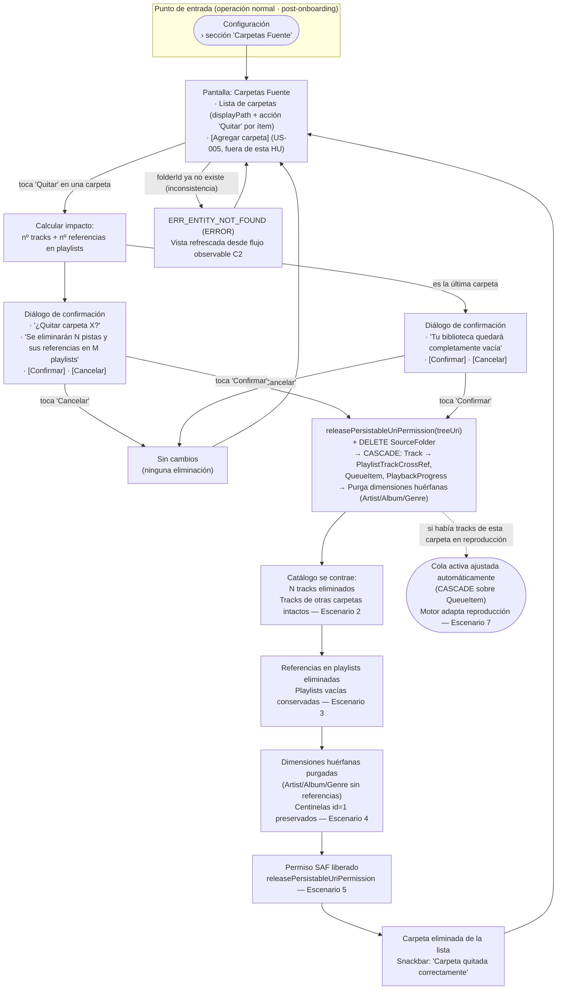

# Preview de Interfaz — HU #US-006: Remover una Carpeta Fuente

> ⚠️ **PROPUESTA PENDIENTE DE VALIDACIÓN CON DISEÑO** — Este prototipo debe ser revisado y aprobado por el equipo de diseño antes de implementarse.
>
> Formato: **Mermaid (flujo de navegación)** · Plataforma inferida: **mobile** · Línea gráfica: *defaults* (sin proyecto frontend en el workspace).

## Leyenda de trazabilidad (AC → flujo)

| AC | Rama del diagrama |
|----|-------------------|
| Escenario 1 (Flujo Principal) | Quitar → calcular impacto → diálogo → Confirmar → execute → cascade → éxito |
| Escenario 2 (Catálogo se contrae) | execute → "Catálogo se contrae: N tracks eliminados" |
| Escenario 3 (Purga en playlists) | cascade → "Referencias en playlists eliminadas; playlists vacías conservadas" |
| Escenario 4 (Dimensiones huérfanas) | cascade → "Dimensiones huérfanas purgadas; centinelas id=1 preservados" |
| Escenario 5 (Permiso SAF liberado) | → `releasePersistableUriPermission` |
| Escenario 6 (Cancelación) | diálogo → Cancelar → "Sin cambios" |
| Escenario 7 (Tracks en cola) | execute -.-> "Cola activa ajustada automáticamente (CASCADE QueueItem)" |
| Escenario 8 (Última carpeta) | FetchImpact → "es la última carpeta" → diálogo especial → Confirmar |
| Escenario 9 (EntityNotFound) | → ERR_ENTITY_NOT_FOUND → vista refrescada |
| Escenario 10 (Autarquía) | Invariante transversal (solo Room/SQLite + SAF; sin red — verificable) |
