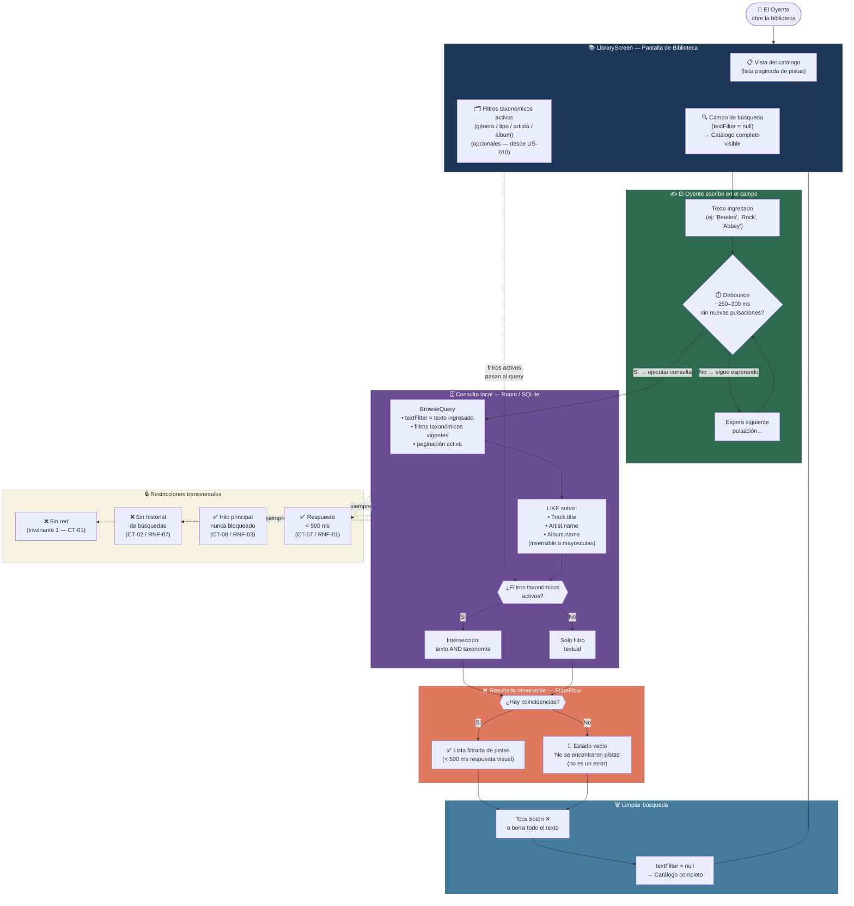

> ⚠️ **PROPUESTA PENDIENTE DE VALIDACIÓN CON DISEÑO** — Este prototipo debe ser revisado y aprobado por el equipo de diseño antes de implementarse.

```mermaid
flowchart TD
    %% Generado para HU #11: Buscar mediante filtro textual local
    %% Plataforma: Mobile (Android nativa — Jetpack Compose, Single-Activity)

    START(["👤 El Oyente\nabre la biblioteca"])

    subgraph LIBRARY["📚 LibraryScreen — Pantalla de Biblioteca"]
        direction TB
        CATALOG_VIEW["📋 Vista del catálogo\n(lista paginada de pistas)"]
        SEARCH_FIELD["🔍 Campo de búsqueda\n(textFilter = null)\n→ Catálogo completo visible"]
        TAXON_FILTERS["🗂️ Filtros taxonómicos activos\n(género / tipo / artista / álbum)\n(opcionales — desde US-010)"]
    end

    subgraph TYPING["✍️ El Oyente escribe en el campo"]
        direction TB
        INPUT_TEXT["Texto ingresado\n(ej: 'Beatles', 'Rock', 'Abbey')"]
        DEBOUNCE{"⏱️ Debounce\n~250–300 ms\nsin nuevas pulsaciones?"}
        DEBOUNCE_WAIT["Espera siguiente\npulsación..."]
    end

    subgraph QUERY["🗄️ Consulta local — Room / SQLite"]
        direction TB
        BUILD_QUERY["BrowseQuery\n• textFilter = texto ingresado\n• filtros taxonómicos vigentes\n• paginación activa"]
        SQL_LIKE["LIKE sobre:\n• Track.title\n• Artist.name\n• Album.name\n(insensible a mayúsculas)"]
        INTERSECT{{"¿Filtros taxonómicos\nactivos?"}}
        WITH_TAXON["Intersección:\ntexto AND taxonomía"]
        WITHOUT_TAXON["Solo filtro\ntextual"]
    end

    subgraph RESULTS["📊 Resultado observable — StateFlow"]
        direction TB
        HAS_RESULTS{{"¿Hay coincidencias?"}}
        SHOW_LIST["✅ Lista filtrada de pistas\n(< 500 ms respuesta visual)"]
        SHOW_EMPTY["🪹 Estado vacío\n'No se encontraron pistas'\n(no es un error)"]
    end

    subgraph CLEAR["🗑️ Limpiar búsqueda"]
        direction TB
        TAP_X["Toca botón ✕\no borra todo el texto"]
        RESET["textFilter = null\n→ Catálogo completo"]
    end

    subgraph RESTRICTIONS["🔒 Restricciones transversales"]
        direction LR
        NO_NET["❌ Sin red\n(Invariante 1 — CT-01)"]
        NO_HISTORY["❌ Sin historial\nde búsquedas\n(CT-02 / RNF-07)"]
        NO_BLOCK["✅ Hilo principal\nnunca bloqueado\n(CT-08 / RNF-03)"]
        LATENCY["✅ Respuesta\n< 500 ms\n(CT-07 / RNF-01)"]
    end

    %% Flujo principal
    START --> LIBRARY
    LIBRARY --> SEARCH_FIELD
    SEARCH_FIELD --> INPUT_TEXT
    INPUT_TEXT --> DEBOUNCE
    DEBOUNCE -- "No → sigue esperando" --> DEBOUNCE_WAIT
    DEBOUNCE_WAIT --> DEBOUNCE
    DEBOUNCE -- "Sí → ejecutar consulta" --> BUILD_QUERY
    TAXON_FILTERS -.->|"filtros activos\npasan al query"| INTERSECT

    BUILD_QUERY --> SQL_LIKE
    SQL_LIKE --> INTERSECT
    INTERSECT -- "Sí" --> WITH_TAXON
    INTERSECT -- "No" --> WITHOUT_TAXON
    WITH_TAXON --> HAS_RESULTS
    WITHOUT_TAXON --> HAS_RESULTS

    HAS_RESULTS -- "Sí" --> SHOW_LIST
    HAS_RESULTS -- "No" --> SHOW_EMPTY

    %% Flujo limpiar búsqueda
    SHOW_LIST --> TAP_X
    SHOW_EMPTY --> TAP_X
    TAP_X --> RESET
    RESET --> CATALOG_VIEW

    %% Restricciones (siempre activas)
    QUERY -.->|"siempre"| NO_NET
    QUERY -.->|"siempre"| NO_HISTORY
    QUERY -.->|"siempre"| NO_BLOCK
    QUERY -.->|"siempre"| LATENCY

    %% Estilos
    style LIBRARY fill:#1d3557,color:#fff,stroke:#1b4332
    style TYPING fill:#2d6a4f,color:#fff,stroke:#1b4332
    style QUERY fill:#6a4c93,color:#fff,stroke:#4a3070
    style RESULTS fill:#e07a5f,color:#fff,stroke:#c05a3f
    style CLEAR fill:#457b9d,color:#fff,stroke:#2c5f7a
    style RESTRICTIONS fill:#f4f1de,color:#333,stroke:#ccc
```
